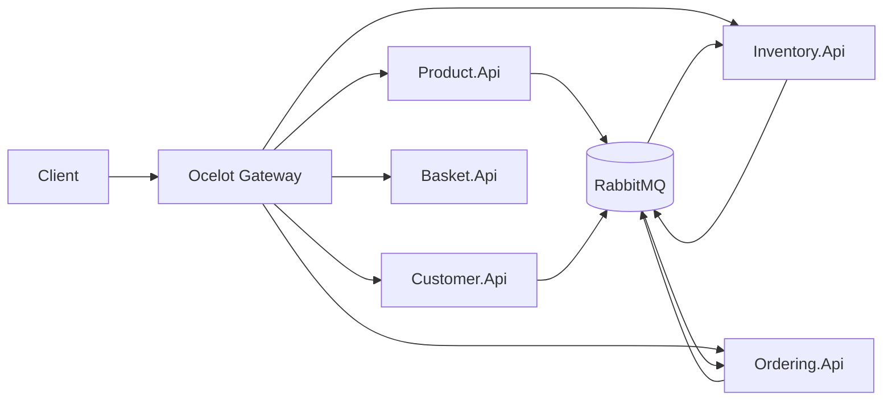

# Kiến trúc microservice (MicroserviceApp)

Tài liệu này mô tả **trạng thái hiện tại** của solution: ranh giới dịch vụ, giao tiếp, hạ tầng cục bộ/Docker, và các cross-cutting concerns đã triển khai.

## Nguyên tắc microservice áp dụng trong repo

| Nguyên tắc | Cách triển khai |
|------------|------------------|
| **Bounded context / tách dữ liệu** | Mỗi dịch vụ có database riêng: Product (MySQL), Customer (PostgreSQL), Ordering (SQL Server), Inventory (MongoDB), Basket (Redis). |
| **Triển khai độc lập** | Mỗi API là project ASP.NET Core riêng; có Dockerfile build từ root repo; có thể scale/redeploy từng container. |
| **Giao tiếp lỏng** | Đồng bộ qua **HTTP** (client → API Gateway → service). **Bất đồng bộ** qua **RabbitMQ** và MassTransit (publish/consume integration events trong `EventBus.Messages`). |
| **API Gateway** | **Ocelot** (`OcelotApiGw`) gom một cổng vào (`http://localhost:5293`), route tới các downstream theo `ocelot.json` (dev) / `ocelot.Docker.json` (môi trường `Docker`). |
| **Quan sát (observability)** | **Serilog** (logging), **OpenTelemetry** tracing gửi OTLP (mặc định `localhost:4317`; trong Docker trỏ **Jaeger** trong `docker-compose.apps.yml`). Health checks `/health` trên từng API. |
| **Bảo mật (tùy chọn)** | **JWT Bearer** (khóa đối xứng HS256) qua building block `AspNetCore.Extensions`: khi `Jwt:Key` **không rỗng**, middleware xác thực + phân quyền được bật với fallback policy yêu cầu authenticated user; Swagger có nút Bearer. Khi `Jwt:Key` rỗng, tất cả endpoint đều truy cập được (không auth). |

## Sơ đồ luồng (tóm tắt)

## Cổng và URL chạy cục bộ (dotnet run)

| Thành phần | HTTP (launchSettings) |
|------------|------------------------|
| OcelotApiGw | 5293 |
| Product.Api | 5037 |
| Customer.Api | 5001 |
| Basket.Api | 5068 |
| Ordering.Api | 5143 |
| Inventory.Api | 5281 |

Gateway proxy các đường dẫn REST đã khai báo trong `src/ApiGateways/OcelotApiGw/ocelot.json` (ví dụ `/api/products`, `/api/customers`, `/api/Basket/...`, `/api/orders`, `/api/inventory`).

## Docker

- **Chỉ infrastructure + DB:** `docker-compose.yml` + `docker-compose.override.yml` (hoặc `docker-compose.dev.yml`).
- **Thêm API + Jaeger + Gateway:** thêm `docker-compose.apps.yml`. Gateway host: **5293** → container **8080**.

Runtime ảnh dùng tag `mcr.microsoft.com/dotnet/*:10.0-preview` (khớp target `net10.0`). Nếu pull thất bại, cập nhật tag theo [Microsoft container registry](https://github.com/dotnet/dotnet-docker).

## Building blocks

- **`AspNetCore.Extensions`**: JWT tùy chọn + fallback authorization policy, OpenTelemetry, Global Exception Handler (`ExceptionMiddleware`), CORS (`CorsExtensions`), helper `AddMicroserviceResilience()` cho `IHttpClientFactory` (retry/circuit breaker qua `Microsoft.Extensions.Http.Resilience`).
- **`Common.Logging`**, **`EventBus.Messages`**, **`Infrastructure`**, **`Contracts`**, **`Shared`**: như các project hiện có.

## Những cải tiến gần đây

- **Global Exception Handler**: Middleware tập trung xử lý mọi exception, trả về `ApiResponse` chuẩn (không leak stack trace).
- **CORS**: Cấu hình AllowAll policy, áp dụng cho tất cả services + Gateway.
- **FluentValidation**: Validators cho Product.Api, Customer.Api, Basket.Api (tự động validate input).
- **Pagination**: `GET /api/products?pageIndex=1&pageSize=20`, `GET /api/customers?pageIndex=1&pageSize=20` trả về `PaginatedResult<T>`.
- **Checkout Event**: Basket.Api checkout publish `OrderCreatedEvent` qua MassTransit thay vì chỉ xóa giỏ hàng.
- **EF Migrations**: Customer.Api (PostgreSQL) và Ordering.Api (SQL Server) đã có migrations.
- **Authorization Policy**: Khi `Jwt:Key` được cấu hình, fallback policy yêu cầu authenticated user trên tất cả endpoint.

## Việc chưa làm hoặc ngoài phạm vi demo

- Identity Server / OIDC đầy đủ, refresh token, phân quyền tinh (policy/roles) — hiện chỉ có validation JWT HS256 khi cấu hình khóa.
- Rate limiting / circuit breaker **ở Gateway** (Ocelot có thể mở rộng thêm).
- Kubernetes manifests, Helm.
- Outbox/inbox pattern, saga orchestration cho giao dịch phân tán — hiện phối hợp chủ yếu qua messaging và logic từng service.

## Tài liệu summary trong repo

- **`src/Services/IMPLEMENTATION_SUMMARY.md`** — checklist và endpoint theo từng API (được đồng bộ với code).
- **`DOCKER_GUIDE.md`**, **`Docker.MD`** — hướng dẫn Docker có sẵn; khi chạy full stack API, ghép thêm `docker-compose.apps.yml` như trên.
