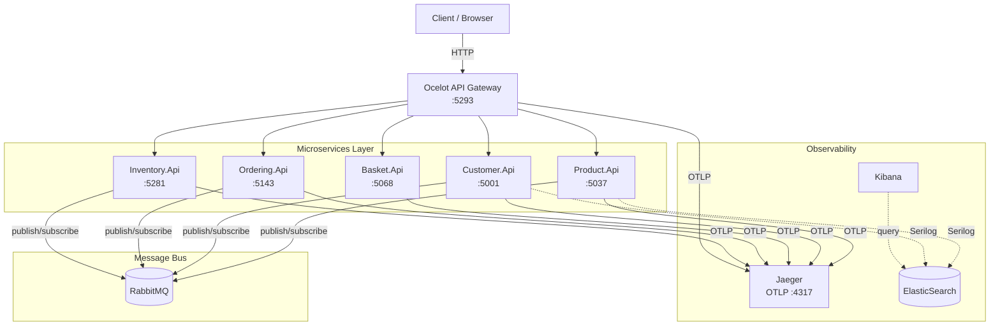
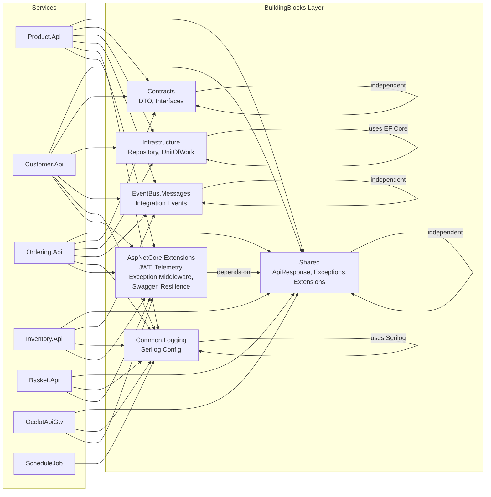
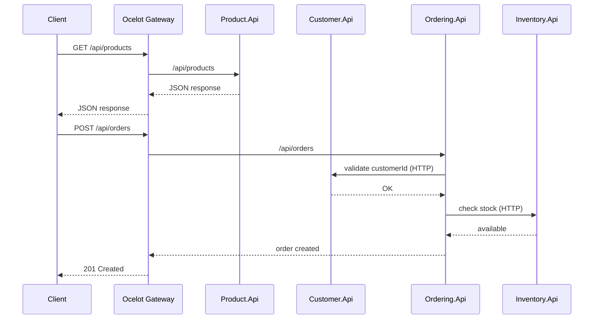
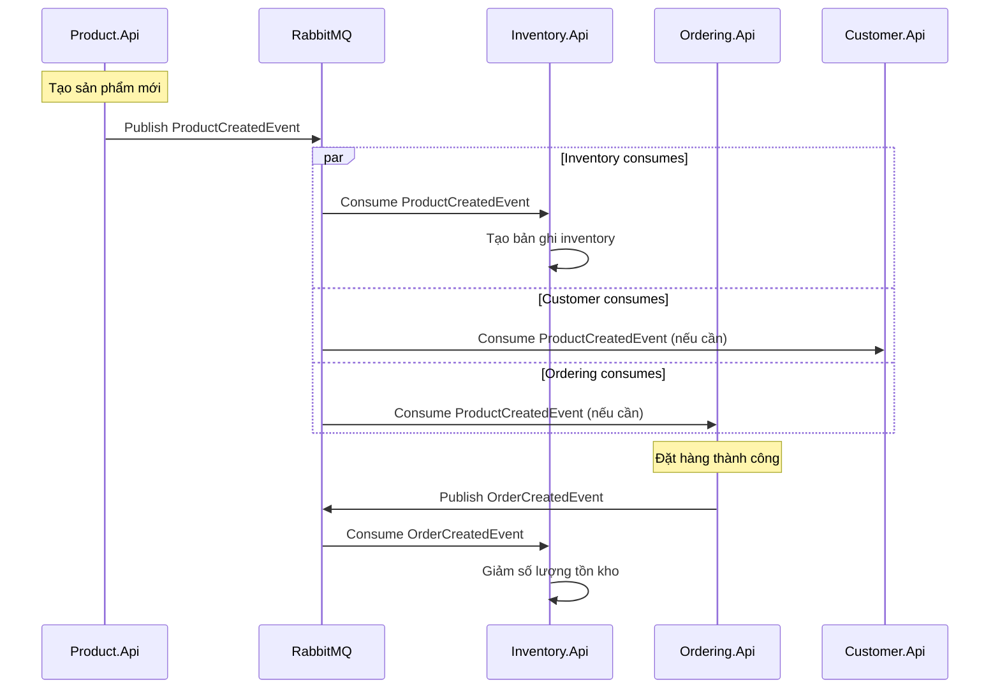
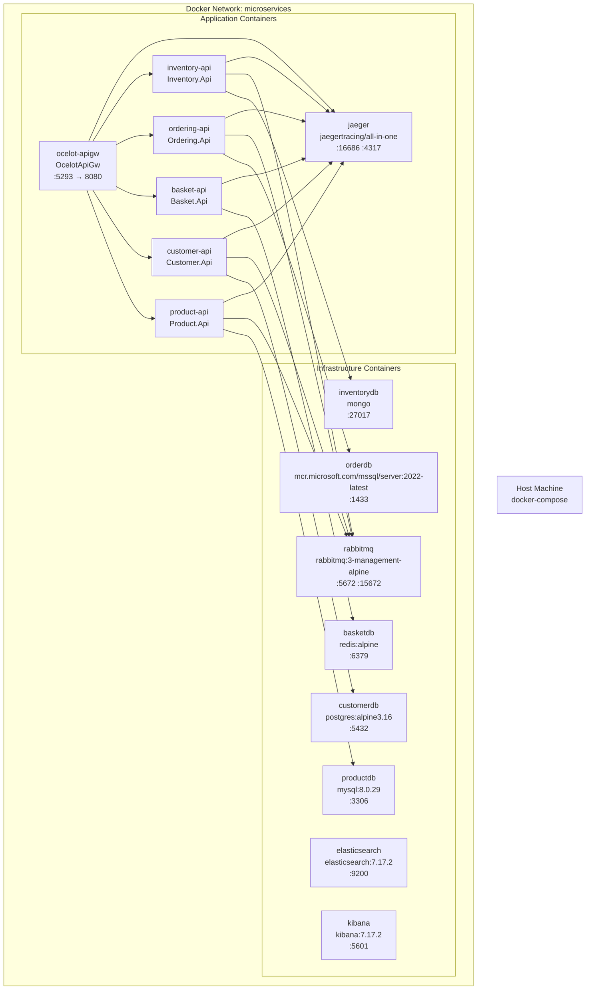

# Sơ đồ Kiến trúc MicroserviceApp

Tài liệu này trình bày các sơ đồ kiến trúc tổng quan của hệ thống MicroserviceApp, bao gồm các BuildingBlocks dùng chung, luồng dữ liệu giữa các service, cơ sở dữ liệu và triển khai Docker.

---

## 1. Sơ đồ tổng quan kiến trúc microservice



**Mô tả:** Client gửi yêu cầu qua API Gateway (Ocelot). Gateway định tuyến đến các service tương ứng. Giao tiếp bất đồng bộ giữa các service thông qua RabbitMQ. Tất cả service đều xuất tracing OpenTelemetry đến Jaeger và log qua Serilog đến ElasticSearch/Kibana.

---

## 2. Sơ đồ BuildingBlocks và dependencies



**Ma trận phụ thuộc:**

| Service | Infrastructure | Shared | Contracts | EventBus | Logging | AspNetCore.Ext |
|---|---|---|---|---|---|---|
| Product.Api | ✅ | ✅ | ✅ | ✅ | ✅ | ✅ |
| Customer.Api | ✅ | ✅ | ✅ | ✅ | ✅ | ✅ |
| Ordering.Api | ✅ | ✅ | ✅ | ✅ | ✅ | ✅ |
| Inventory.Api | ✅ | ✅ | ❌ | ✅ | ✅ | ✅ |
| Basket.Api | ❌ | ✅ | ❌ | ✅ | ✅ | ✅ |
| OcelotApiGw | ❌ | ❌ | ❌ | ❌ | ✅ | ✅ |
| ScheduleJob | ❌ | ❌ | ❌ | ❌ | ✅ | ❌ |

---

## 3. Sơ đồ luồng dữ liệu giữa các service

### Luồng đồng bộ (HTTP qua API Gateway)



### Luồng bất đồng bộ (Event Bus qua RabbitMQ)



### Các sự kiện được định nghĩa trong EventBus.Messages

| Event | Publisher | Consumer(s) |
|---|---|---|
| ProductCreatedEvent | Product.Api | Inventory.Api, Customer.Api |
| ProductUpdatedEvent | Product.Api | Inventory.Api |
| ProductDeletedEvent | Product.Api | Inventory.Api |
| ProductStockUpdatedEvent | Inventory.Api | Product.Api |
| CustomerCreatedEvent | Customer.Api | Ordering.Api |
| OrderCreatedEvent | Ordering.Api | Inventory.Api |

---

## 4. Sơ đồ database của từng service

```mermaid
flowchart TB
    subgraph ProductDB ["Product.Api — MySQL"]
        P_Products[Products<br/>Id BIGINT PK<br/>Name NVARCHAR<br/>Price DECIMAL<br/>StockQuantity INT<br/>CategoryId BIGINT<br/>CreatedAt DATETIME]
        P_Categories[Categories<br/>Id BIGINT PK<br/>Name NVARCHAR<br/>Description TEXT]
        P_Suppliers[Suppliers<br/>Id BIGINT PK<br/>Name NVARCHAR<br/>ContactEmail NVARCHAR]
    end

    subgraph CustomerDB ["Customer.Api — PostgreSQL"]
        C_Customers[Customers<br/>Id BIGINT PK<br/>FirstName NVARCHAR<br/>LastName NVARCHAR<br/>Email NVARCHAR UNIQUE<br/>Phone NVARCHAR<br/>DateOfBirth DATE<br/>CreatedAt TIMESTAMP]
        C_Addresses[Addresses<br/>Id BIGINT PK<br/>CustomerId BIGINT FK<br/>Street NVARCHAR<br/>City NVARCHAR<br/>Country NVARCHAR<br/>IsDefault BOOLEAN]
    end

    subgraph OrderingDB ["Ordering.Api — SQL Server"]
        O_Orders[Orders<br/>Id BIGINT PK<br/>CustomerId BIGINT<br/>OrderDate DATETIME2<br/>Status NVARCHAR<br/>TotalAmount DECIMAL<br/>ShippingAddressId BIGINT]
        O_OrderItems[OrderItems<br/>Id BIGINT PK<br/>OrderId BIGINT FK<br/>ProductId BIGINT<br/>Quantity INT<br/>UnitPrice DECIMAL]
        O_Payments[Payments<br/>Id BIGINT PK<br/>OrderId BIGINT FK<br/>Amount DECIMAL<br/>PaymentMethod NVARCHAR<br/>Status NVARCHAR<br/>PaidAt DATETIME2]
    end

    subgraph InventoryDB ["Inventory.Api — MongoDB"]
        I_Inventory[InventoryItems<br/>{<br/>  _id: ObjectId,<br/>  ProductId: Int64,<br/>  ProductName: string,<br/>  WarehouseCode: string,<br/>  QuantityOnHand: int,<br/>  ReservedQuantity: int,<br/>  LastRestocked: Date<br/>}]
        I_Warehouses[Warehouses<br/>{<br/>  _id: ObjectId,<br/>  Code: string,<br/>  Name: string,<br/>  Location: string<br/>}]
    end

    subgraph BasketDB ["Basket.Api — Redis"]
        B_Basket[Cart Key: string<br/>{<br/>  UserName: string,<br/>  Items: CartItem[],<br/>  TotalPrice: decimal<br/>}]
    end

    ProductDB -->|EF Core| Product
    CustomerDB -->|EF Core| Customer
    OrderingDB -->|EF Core| Ordering
    InventoryDB -->|MongoDB Driver| Inventory
    BasketDB -->|StackExchange.Redis| Basket
```

| Service | Database Engine | ORM/Driver |
|---|---|---|
| Product.Api | MySQL 8.0 | EF Core |
| Customer.Api | PostgreSQL (Alpine) | EF Core |
| Ordering.Api | SQL Server 2022 | EF Core |
| Inventory.Api | MongoDB | MongoDB.Driver |
| Basket.Api | Redis (Alpine) | StackExchange.Redis |

---

## 5. Sơ đồ deployment (Docker)



### Cách chạy

```bash
# Chỉ infrastructure (DB + message queue)
docker-compose -f docker-compose.yml -f docker-compose.override.yml up -d

# Infrastructure + ứng dụng + Jaeger
docker-compose -f docker-compose.yml -f docker-compose.override.yml -f docker-compose.apps.yml up -d --build

# Môi trường production
docker-compose -f docker-compose.yml -f docker-compose.prod.yml up -d --build
```

| Container | Image | Port (Host) |
|---|---|---|
| `productdb` | mysql:8.0.29 | 3306 |
| `customerdb` | postgres:alpine3.16 | 5432 |
| `orderdb` | mcr.microsoft.com/mssql/server:2022-latest | 1433 |
| `inventorydb` | mongo | 27017 |
| `basketdb` | redis:alpine | 6379 |
| `rabbitmq` | rabbitmq:3-management-alpine | 5672, 15672 |
| `elasticsearch` | elasticsearch:7.17.2 | 9200 |
| `kibana` | kibana:7.17.2 | 5601 |
| `jaeger` | jaegertracing/all-in-one:latest | 16686, 4317 |
| `ocelot-apigw` | (build từ Dockerfile) | 5293 → 8080 |
| `product-api` | (build từ Dockerfile) | — |
| `customer-api` | (build từ Dockerfile) | — |
| `basket-api` | (build từ Dockerfile) | — |
| `ordering-api` | (build từ Dockerfile) | — |
| `inventory-api` | (build từ Dockerfile) | — |

---

> **Ghi chú:** Tất cả container chạy trong cùng mạng Docker `microservices` (bridge driver). API Gateway là cổng vào duy nhất từ bên ngoài (port 5293). Các service nội bộ giao tiếp qua hostname container. OpenTelemetry tracing được cấu hình qua biến môi trường `OTEL_EXPORTER_OTLP_ENDPOINT` trỏ đến Jaeger.
